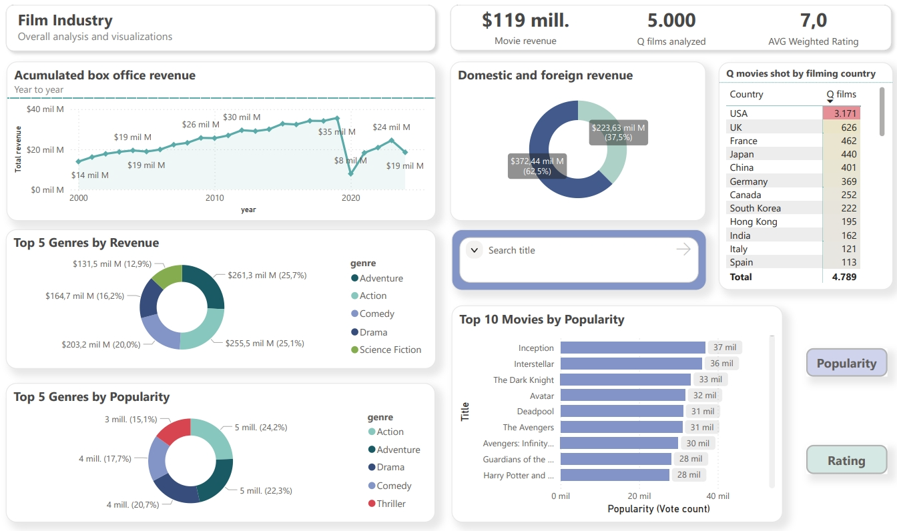
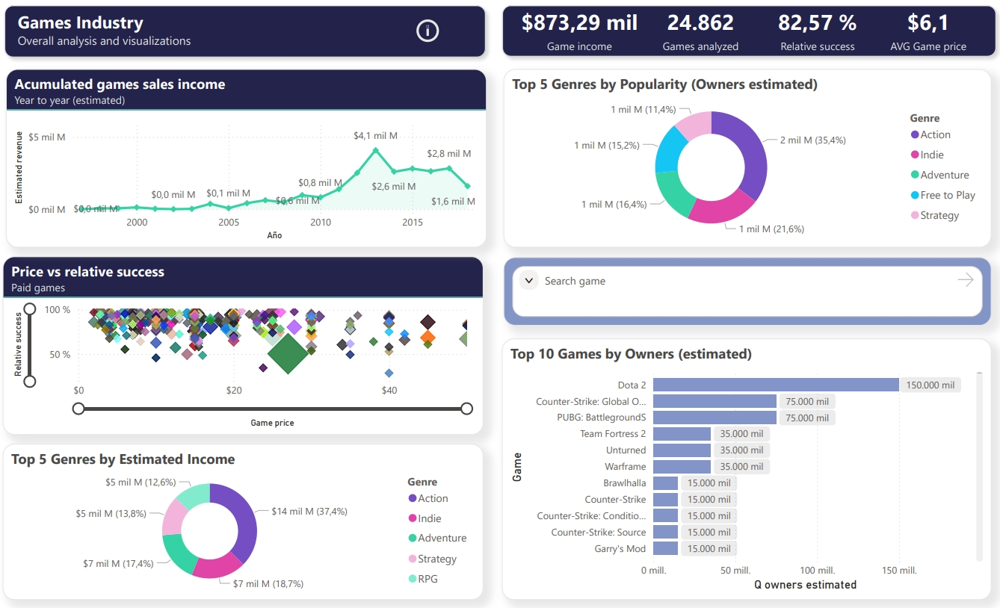
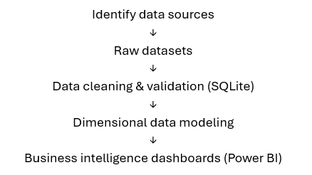
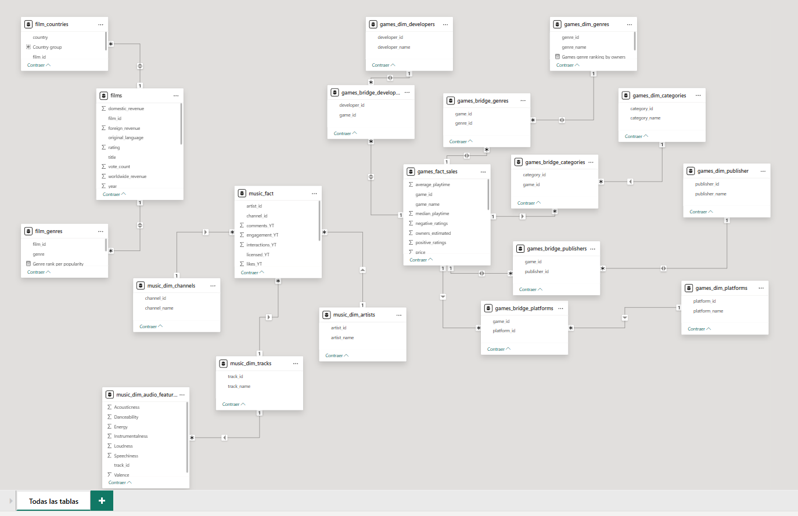
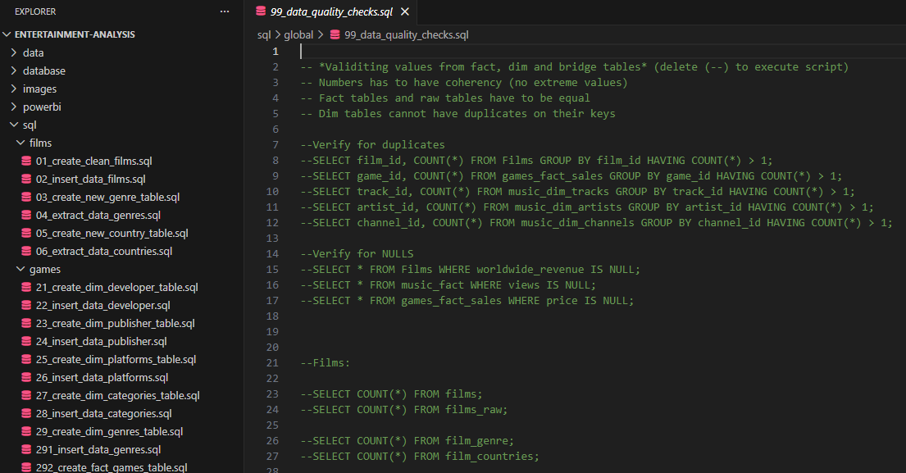

# Entertainment Industry Analysis through Data Cleaning and BI
Exploratory analytics project analyzing trends in the entertainment industry using **SQL, Power BI, Excel, Python VScode (for SQL documentation) and Kaggle datasets**.  The final analysis focuses on **film and video games**, as the music dataset was excluded due to insufficient transparency in its source and methodology.

## Project Overview

This project analyzes trends across the entertainment industry, focusing on film box office performance and video game market dynamics.
The analysis was developed as an **end-to-end data analytics solution**, including data cleaning, validation, dimensional modeling, and interactive dashboard creation using SQL and Power BI (which can be found in the [powerbi/](https://github.com/lucasmerlino33/Entertainment-Industry-Analysis-through-Data-Cleaning-and-BI/tree/main/powerbi) directory).
Public datasets from Kaggle were used as the primary data source. 

The project was structured to simulate a **client-oriented scenario**, aiming to explore **historical trends**, analyze **individual cases**, and generate insights applicable to future creative **decisions**.
During the exploratory phase, the **music dataset was excluded** due to insufficient transparency in its origin and methodology. This decision was made to ensure that the analysis is based on **reliable and well-documented data**.

## Business Objective

The objective of this project is to **analyze patterns in the entertainment industry** in order to support **data-driven decision-making**.
Specifically, the analysis aims to:

- Identify trends in **film revenue and genre performance**
- Evaluate the **distribution of success** across **video game** titles
- Explore **individual cases** to understand factors associated with **higher performance**
- Provide **insights** that can inform future creative and strategic **decisions**

## Content Table

1.	[Project Overview](#project-overview)
2.	[Business Objective](#business-objective)
3.	[Dashboard Preview](#dashboard-preview)
4.	[Key Insights](#key-insights)
5.	[Data Pipeline](#data-pipeline)
6.	[Data Sources](#data-sources)
7.	[Data Cleaning & Modeling](#data-cleaning--modeling)
8.	[Data Quality Checks](#data-quality-checks)
9.	[Challenges & Limitations](#challenges--limitations)
10.	[Conclusions](#conclusions)

## Dashboard Preview

### Films Analysis

This dashboard provides an overview of film performance, including **total revenue** (overall and YTY), **average weighted rating**, and **distribution by genre**.

Users can explore trends over time, compare genre performance, identify top movies by popularity or rating and analyze individual films using interactive filters.

### Games Analysis

This dashboard focuses on video game performance, including **ownership estimates**, **pricing**, and **rating distribution**.

It allows users to explore relationships between price, popularity, and user ratings, as well as identify top-performing titles and genres. It also use interactive filters.

## Key Insights

### Global

- A small number of titles **dominate revenue and popularity** across both films and video games, following a clear **long-tail (Pareto-like) distribution**.
- In both industries, the most popular genres are **Action and Adventure** (excluding the Indie category in games).

---

### Games

- A significant **shift in the gaming market** can be observed around **2011**, coinciding with the rise of **YouTube gaming content**, increased **platform accessibility**, and **industry expansion**.
- Video game **ownership** is highly concentrated, with a small number of titles accounting for a large share of total players, particularly **Free-to-Play** games.
- There is **no strong linear relationship** between **price and popularity**, suggesting that factors such as **genre**, **quality**, and **visibility** play a more important role.
- User **ratings** tend to cluster within a **narrow range**, indicating **limited variability** in perceived **quality** across titles.

---

### Films

- **Total revenue** reflects **current** box office values. For example, some classic films (e.g., *The Godfather*) appear with **relatively low revenue** due to the 4k version, re-released in 2022 for the 50th anniversary, rather than original performance.
- Genres such as **Action and Adventure** consistently generate **higher revenue**, while less frequent genres (e.g., War or History) contribute less to overall performance.
- The dataset is **heavily dominated** by **U.S. productions**, which may reflect greater global reach and commercial success rather than actual production volume.
- **Drama and Comedy** are the **most frequent** genres in the dataset (over 2.000 and 1.900 films respectively), although **frequency** does **not** necessarily imply **higher success**.
- A **sharp decline** in **revenue** is observed in 2020, likely due to the impact of the **COVID-19 pandemic**.
- **Genre popularity** has shifted over time: **Drama** was the most common genre around **2000**, while **Action** dominates in **more recent years**.

## Data Pipeline

The project follows a structured analytical workflow:

Each stage of the pipeline ensures **data consistency**, **reliability**, and **usability** for analysis. 

**Raw datasets** are transformed into structured tables through **SQL-based cleaning** and **validation processes**. These tables are then modeled into a **dimensional schema** to support **efficient querying** and **accurate aggregation in Power BI dashboards**.

## Data Sources

All datasets were obtained from **Kaggle**. These datasets are publicly available and created by users.

- [Films source](https://www.kaggle.com/datasets/aditya126/movies-box-office-dataset-2000-2024): Data compiled from Box Office Mojo and the TMDB API (The Movie Database).

- [Games source](https://www.kaggle.com/datasets/nikdavis/steam-store-games): Data collected using Steam Store and SteamSpy APIs.

- [Music source](https://www.kaggle.com/datasets/sanjanchaudhari/spotify-dataset/data): This dataset combines Spotify and YouTube metrics. However, its origin and data collection methodology are not clearly documented. Although excluded from the final analysis, it is included for reference as exploratory data analysis (EDA) was performed on it.

## Data Cleaning & Modeling

Several transformations were applied to prepare the datasets for analysis. All transformation steps are documented in the [sql/](https://github.com/lucasmerlino33/Entertainment-Industry-Analysis-through-Data-Cleaning-and-BI/tree/main/sql) directory to ensure reproducibility.

Key processes included:

- Creation of **primary and foreign keys**
- **Removal of formatting** elements such as currency symbols and percentage signs
- **Conversion** of text-based numerical values into numeric formats
- Handling of missing (**NULL**) or inconsistent values
- **Standardization** of column names and data types, including removal of unnecessary fields
- **Splitting of multi-value fields** (e.g., genres, countries, developers) into normalized tables

Additionally, **character encoding** issues (e.g., Latin-1 to UTF-8) were resolved using **Python** to ensure data consistency.

The cleaned data was structured using a dimensional modeling approach:

- **Films dataset** → main table with supporting bridge tables for genres and production countries  
- **Games dataset** → star schema with a fact table and multiple dimension tables (developers, publishers, genres, platforms, categories), including bridge tables  
- **Music dataset** → fully modeled star schema, later excluded from analysis due to data reliability concerns  

This structure ensures **accurate aggregations** and **supports flexible analysis** in Power BI.

The modeling approach follows **common data warehousing practices**, enabling scalable and consistent analytical queries.

## Data Quality Checks

To ensure data reliability, several validation checks were performed throughout the transformation process:

- Verification of **row count consistency** between raw and transformed tables
- Detection of **NULL or missing values** in key fields
- Validation of **referential integrity** between fact and dimension tables
- Identification of **duplicate records** and inconsistent entries
- Basic sanity checks to detect **outliers or unrealistic values**

These checks were implemented using SQL queries, documented in the [sql/global/](https://github.com/lucasmerlino33/Entertainment-Industry-Analysis-through-Data-Cleaning-and-BI/tree/main/sql/global) directory, and applied repeatedly during the data preparation phase, along with the full SQL script schema to recreate all tables from scratch.

## Challenges & Limitations

Several challenges were encountered during the project:

- **Inconsistent formatting** across datasets (e.g., currency symbols, encoding issues), requiring additional cleaning steps
- Presence of **multi-value fields** stored as text, which required normalization into separate tables
- Lack of **unique identifiers** in some datasets, requiring the creation of surrogate keys
- Estimated values (e.g., game ownership ranges), which required approximation methods for analysis

Additionally, some limitations should be considered:

- The datasets are **user-generated**, which may introduce biases or inaccuracies
- The music dataset lacked sufficient transparency in its origin and methodology, leading to its exclusion from the final analysis
- The games dataset is limited to data up to 2018. As a result, it does not capture the impact of the COVID-19 pandemic, which likely played a significant role in the industry's recent growth.
- Film revenue reflects **current box office values**, which may not represent original historical performance
- The dataset is **not exhaustive**, and results should be interpreted as indicative rather than definitive

These constraints were taken into account when interpreting the results and drawing conclusions.

## Conclusions

This project highlights how success in the entertainment industry is highly concentrated, with a small number of titles capturing the majority of revenue and audience attention across both films and video games.

Despite differences between industries, similar patterns emerge: popularity is driven by a combination of visibility, genre appeal, and market reach rather than a single dominant factor such as price or frequency.

The analysis also reinforces the importance of data quality and modeling decisions. Careful data cleaning, validation, and structuring were essential to ensure accurate insights and avoid misleading conclusions.

Additionally, the project demonstrates how publicly available data can be transformed into a structured analytical solution, enabling meaningful exploration and supporting data-driven decision-making.

Overall, this work reflects a complete analytical workflow, from raw data to actionable insights, with a strong focus on reliability, clarity, and business relevance.

The findings suggest that understanding market dynamics in entertainment requires both robust data modeling and critical interpretation, as surface-level metrics alone are not sufficient to explain success.
